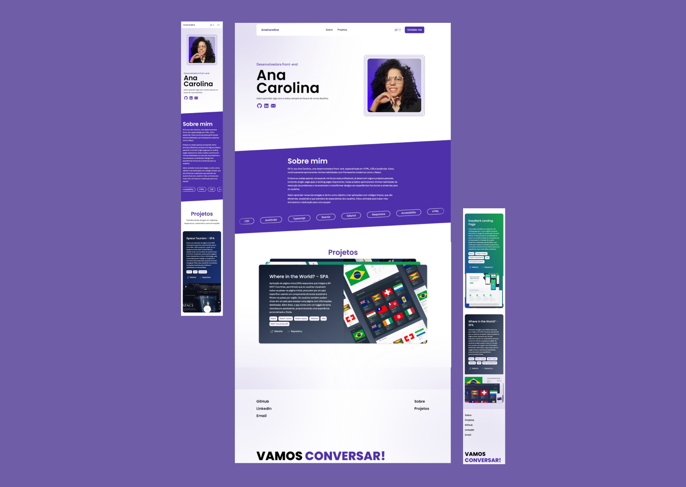

# My Portfolio

This is my portfolio website designed and developed by me to show case my projects and coding skills.

## Table of contents

- [Overview](#)
  - [Screenshot](#screenshot)
  - [Link](#link)
- [My process](#my-process)
  - [Build with](#build-with)
  - [What I learned](#what-i-learned)
  - [continued development](#continued-development)
  - [Useful resources](#useful-resourses)

### Screenshot

### Link

- Live site: 

## My process

### Build with

- Semantic HTML5 markup
- Flexbox
- CSS Grid
- Mobile-first workflow
- [Vite](https://vite.dev/) - Frontend tooling
- [React](https://react.dev/) - JS UI framework
- [Typescript](https://www.typescriptlang.org/) - Typed JS
- [Tailwind](https://tailwindcss.com/) - CSS framework
- [Framer Motion](https://motion.dev/) - React animations library
- [react-i18next](https://react.i18next.com/) - Internationalization framework for React / React Native

### What I learned

Throughout the development of my portfolio, I gained valuable insights in several key areas:

- **Internationalization:** By integrating React i18next, I learned how to make my portfolio easily adaptable to English and Portuguese, enabling a seamless experience for a larger audience.

- **Component Style Variants:** I designed flexible and responsive components using the Tailwind framework, and by leveraging Tailwind merge and TypeScript's Record type, I learned to dynamically handle different styles based on props, allowing me to reuse components efficiently across my portfolio.

- **Animations with Tailwind and Framer Motion:** I explored the power of animations in creating an engaging user experience. Using Tailwind, I applied subtle yet effective transitions. Framer Motion enhanced this further with advanced effects like reveal animations, staggered text, mouse-triggered 3D tilt card, scroll-triggered stacked cards, and dynamic hide/show behavior for the navbar on scroll. These animations brought my portfolio to life, adding a modern touch and smooth transitions.

### Continued development

I enjoy exploring 3D design in my free time by learning about tools like Blender and Spline to create 3D content. I'm also learning WebGL and Three.js to bring 3D experiences to the web. My goal is to build an immersive 3D website eventually.

### Useful resources

- [Stacked Cards with Sticky Positioning and a Dash of Sass](https://css-tricks.com/stacked-cards-with-sticky-positioning-and-a-dash-of-sass/)
- [Corey Ginnivan portfolio](https://corey.ginnivan.net/)
- [5 - Simplify Button Styling for All Possible Variants - Problem](https://youtu.be/wq4yO1GHe9w?si=pLBFWI2od9p2XgwI)
- [React Localization - Internationalize with i18next](https://locize.com/blog/react-i18next/)
- [Localization In React - Make Your Websites International ](https://youtu.be/0GmDPAlwifs?si=2TKyCFZkymBYQyZy)
- [React i18next (Complete Tutorial)](https://youtu.be/U4_P_l3L_EA?si=4WFl1rNmL8MRleaI)
- [Build a Smooth Scroll Cards Parallax with Framer Motion and Next.js](https://youtu.be/am0ZueQmpzg?si=ufO3TqDDG-oKVpXV)
- [Making a CSS Only Infinite Text Marquee](https://youtu.be/uw5jVO1eNF8?si=6QO7WxeFbskWlFMR)
- [Staggered Text Animation with React and Framer Motion](https://youtu.be/blUpQMJjObE?si=z-lsDDIPULFFwtEV)
- [On-Scroll Reveal Animation with React & Framer Motion](https://youtu.be/hjbxaYTMhy0?si=jZ_8JVj3p52i7GIj)
- [Complex Animations with Framer Motion & React || useAnimate Hook](https://youtu.be/Ec03ndZle3Q?si=Ao0v-jvtl6xg0VwU)
- [Mouse Hover Tilt Card Effect || React, Framer Motion & Tailwind CSS](https://youtu.be/-PBw8mv9ZYc?si=io2B-BXoxUmNMLxj)
- [Narrowing - Discriminated Unions](https://www.typescriptlang.org/docs/handbook/2/narrowing.html#discriminated-unions)
- [Hide Navigation on Page Scroll || Framer Motion useMotionValueEvent](https://youtu.be/qc2kQcicNNc?si=_GK-qLWcCBhHTd6I)
